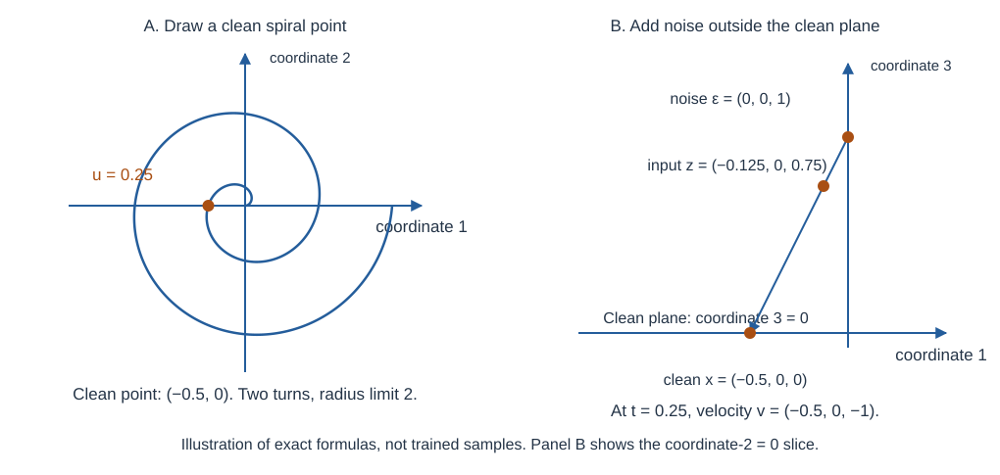
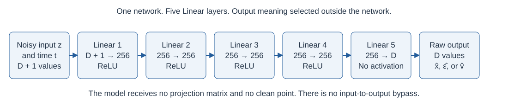
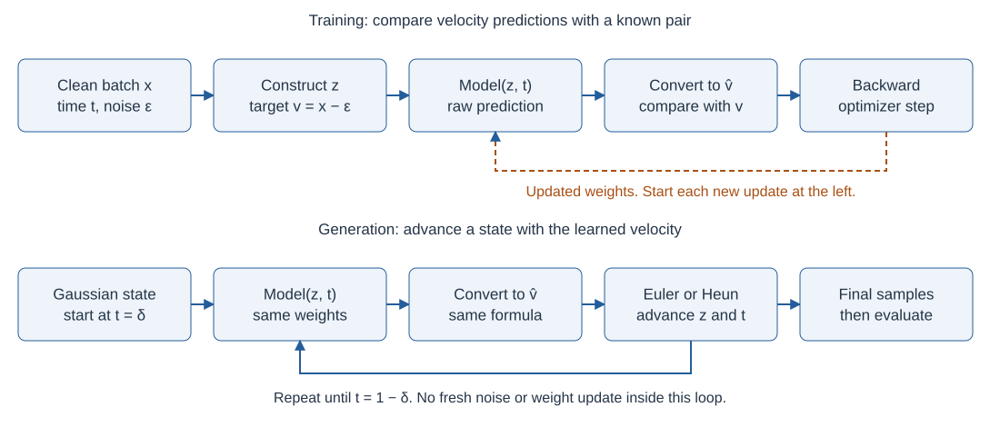

# Generate a spiral from noise

A small network learns to generate spiral points from Gaussian noise. The experiment asks whether predicting clean points, noise, or velocity changes that task. The clean points occupy a plane, while noise fills every observed coordinate. The package currently supplies configuration and command infrastructure. Its numerical functions remain exercises, so the examples below establish the intended behavior rather than measured training results.

## Contents

- [1. Draw the clean data](#1-draw-the-clean-data)
- [2. One sample through the data path](#2-one-sample-through-the-data-path)
- [3. One sample through the flow equations](#3-one-sample-through-the-flow-equations)
- [4. Build the model and train it](#4-build-the-model-and-train-it)
- [5. Generate and inspect new points](#5-generate-and-inspect-new-points)
- [6. Relationship to the full JiT code](#6-relationship-to-the-full-jit-code)
- [7. Configuration and reproducibility](#7-configuration-and-reproducibility)
- [8. Verification order and next action](#8-verification-order-and-next-action)

## 1. Draw the clean data

Start with a two-coordinate spiral. A point near the center has a small radius. As the radius increases, the point turns around the center. The local baseline uses two turns and a radius limit of 2.

For one point, draw a number $u$ uniformly from $[0,1)$. Use that same number for both radius and angle. Let $K$ denote `spiral_turns` and $\rho$ denote `spiral_radius`:

$$
u\sim\mathrm{Uniform}[0,1),\qquad r=\rho u,\qquad \phi=2\pi K u,\qquad \hat x(u)=\bigl(r\cos\phi,r\sin\phi\bigr).
$$

With $K=2$, $\rho=2$, and $u=0.25$, the radius is $0.5$ and the angle is $\pi$. The clean point is therefore $\hat x=(-0.5,0)$, apart from floating-point rounding. Drawing radius and angle independently would fill an area instead of tracing this curve.

How does this point become a noisy training input? The following figure follows that point into three observed coordinates.

- Panel A traces the local spiral formula. The orange point is $(-0.5,0)$ at $u=0.25$, in coordinate units.
- Panel B shows one example with third-coordinate noise of 1. At $t=0.25$, the noisy input has third coordinate $0.75$.
- The figure shows exact construction rules. It contains no generated samples and cannot show training quality. Panel B shows a slice where coordinate 2 is zero.

The word “intrinsic” refers here to the two source coordinates. The spiral itself is a one-parameter curve within that plane. These are different dimensions: two coordinates store the point, but one parameter traces the curve.

Uniform draws of $u$ do not give uniform spacing along the curve. Differentiating the spiral gives its speed with respect to $u$:

$$
\left\lVert\frac{d\hat x}{du}\right\rVert_2=\rho\sqrt{1+(2\pi K u)^2}.
$$

At larger $u$, the same small parameter interval covers more curve length. The sample density per unit curve length therefore decreases toward the outside. Keep this distribution unchanged when comparing prediction targets.

[D01, `sample_spiral`](src/jit_toy/data.py#L18) must return $N\times2$ finite float32 points for count $N$. It must consume the supplied random generator. The radial bound follows directly from $r=\rho u<\rho$.

## 2. One sample through the data path

### 2.1 Hide the spiral in more coordinates

The model must learn from observed coordinates rather than receive the original two-coordinate points. For a hand calculation, embed the point $\hat x=(-0.5,0)$ into three coordinates with

$$
P=\begin{bmatrix}1&0\cr 0&1\cr 0&0\end{bmatrix},\qquad P^{\mathsf T}P=I_2.
$$

Each column has length one, and the columns are perpendicular. The package stores each sample as a row. Embedding and projection therefore give

$$
x=\hat xP^{\mathsf T}=(-0.5,0,0),\qquad xP=(-0.5,0).
$$

The simple matrix makes the arithmetic visible. Actual experiment runs use a fixed random matrix with $D$ rows and two columns. The observed dimension $D$ determines how many coordinates the model receives.

[D02, `make_projection`](src/jit_toy/data.py) must draw a Gaussian matrix $A$ and compute a reduced QR decomposition:

$$
A=PR,\qquad A,P\in\mathbb R^{D\times2},\qquad P^{\mathsf T}P=I_2.
$$

Here $R$ is triangular. The orthonormal factor $P$ embeds the clean plane without stretching it. Create this matrix once for each observed dimension and projection seed. Reuse it across batches, prediction targets, checkpoints, and plots.

### 2.2 Preserve the clean geometry

For any two source rows $a$ and $b$, the embedding preserves squared distance:

$$
\lVert(a-b)P^{\mathsf T}\rVert_2^2=(a-b)P^{\mathsf T}P(a-b)^{\mathsf T}=\lVert a-b\rVert_2^2.
$$

Setting $b=0$ also proves preservation of lengths. Projection reverses embedding because $P^{\mathsf T}P=I_2$. Do not rescale clean points when increasing $D$.

Data construction and evaluation own $P$. The model receives neither $P$ nor the source points. Otherwise, the model would receive the hidden structure that this experiment asks it to learn.

### 2.3 Make a batch with explicit shapes

A batch contains $B$ observed clean rows. For example, four samples at $D=3$ form a $4\times3$ tensor. Each sample later receives one time value and three independent noise values.

| Value | Shape | Owner |
| --- | --- | --- |
| Source points | $N\times2$ | Data construction and evaluation |
| Projection $P$ | $D\times2$ | Data construction, checkpoint, and evaluation |
| Clean batch $x$ | $B\times D$ | Dataset and training loop |
| Time $t$ | $B\times1$ | Training loop or sampler |
| Noise $\epsilon$, input $z_t$, and output | $B\times D$ | Training loop or sampler |
| Loss | Scalar tensor | One training update |

Create random tensors on the central processing unit (CPU) in float32 with explicit `torch.Generator` instances. Transfer complete tensors to the model device. Keep the time column shaped $B\times1$ so it broadcasts across coordinates rather than across samples.

## 3. One sample through the flow equations

### 3.1 Construct a noisy point and its velocity

Continue the three-coordinate example. Choose $x=(-0.5,0,0)$, noise $\epsilon=(0,0,1)$, and time $t=0.25$. This noise vector is illustrative, rather than a random draw used in a reported run.

Interpolate between noise and clean data:

$$
z_t=tx+(1-t)\epsilon=(-0.125,0,0.75).
$$

At time zero, this formula gives pure noise. At time one, it gives the clean point. Holding the pair $(x,\epsilon)$ fixed and differentiating with respect to time gives its velocity:

$$
v=\frac{dz_t}{dt}=x-\epsilon=(-0.5,0,-1).
$$

In this example, the point moves left and toward the clean plane. The network sees only $z_t$ and $t$. Training retains $x$ and $\epsilon$ to construct the target velocity.

Actual runs draw independent standard Gaussian noise in all $D$ coordinates:

$$
\epsilon\sim\mathcal N(0,I_D).
$$

Restricting noise to the clean plane would remove the perpendicular prediction problem. [F02, `make_flow_batch`](src/jit_toy/flow.py#L50) must construct the input and target from explicit clean data, time, and noise.

### 3.2 Give the network output one of three meanings

All three models return $D$ numbers. The run assigns those numbers one meaning: predicted clean data $\hat x$, predicted noise $\hat\epsilon$, or predicted velocity $\hat v$.

The relations $z_t=\epsilon+tv$ and $z_t=x-(1-t)v$ convert any of these outputs into velocity:

$$
\hat v_x=\frac{\hat x-z_t}{1-t},\qquad
\hat v_\epsilon=\frac{z_t-\hat\epsilon}{t},\qquad
\hat v_v=\hat v.
$$

For the worked point, correct outputs must produce the same velocity:

| Output meaning | Correct direct output | Converted velocity at $t=0.25$ |
| --- | --- | --- |
| Clean data | $(-0.5,0,0)$ | $(-0.5,0,-1)$ |
| Noise | $(0,0,1)$ | $(-0.5,0,-1)$ |
| Velocity | $(-0.5,0,-1)$ | $(-0.5,0,-1)$ |

For clean prediction, the third velocity coordinate is $(0-0.75)/0.75=-1$. The network outputs zero there. The conversion supplies the perpendicular motion from the observed input.

A second scalar check uses $x=2$, $\epsilon=-1$, and $t=0.25$. It gives $z_t=-0.25$ and $v=3$. Correct direct outputs $2$, $-1$, and $3$ must each convert to velocity $3$.

[F03, `to_velocity`](src/jit_toy/flow.py#L67) implements these formulas outside the network. The configuration values `x`, `eps`, and `v` select the output meaning. Preserve the gradient through this conversion.

### 3.3 Use one velocity loss for every output meaning

Training compares converted velocity with the known target $v=x-\epsilon$. For $B$ samples and $D$ coordinates, the package uses

$$
L_v=\frac{1}{BD}\sum_{i=1}^{B}\lVert\hat v_i-v_i\rVert_2^2.
$$

The norm sums squared coordinate errors. Dividing by $BD$ produces their mean across samples and coordinates. [F04, `velocity_loss`](src/jit_toy/flow.py#L86) must reject unequal shapes before reducing them.

For one two-coordinate sample, take predicted velocity $(2,0)$ and target $(1,-2)$. The squared errors are 1 and 4, so its mean loss is $2.5$. This is a calculation check, not a training result.

The same velocity objective applies different time weights to errors in the direct outputs:

$$
\hat v_x-v=\frac{\hat x-x}{1-t},\qquad
\hat v_\epsilon-v=-\frac{\hat\epsilon-\epsilon}{t}.
$$

For the scalar check, give each direct output an error of magnitude $0.2$. Its squared error is $0.04$.

| Direct output | Velocity loss for one $D$-coordinate sample | Scalar loss at $t=0.25$ |
| --- | --- | --- |
| Clean data | $\lVert\hat x-x\rVert_2^2/[D(1-t)^2]$ | $0.04/0.75^2\approx0.0711$ |
| Noise | $\lVert\hat\epsilon-\epsilon\rVert_2^2/(Dt^2)$ | $0.04/0.25^2=0.64$ |
| Velocity | $\lVert\hat v-v\rVert_2^2/D$ | $0.04$ |

Thus, a common velocity loss does not make the direct prediction tasks identical. Report both $L_v$ and $DL_v$ across dimensions. The second quantity retains the sum of coordinate errors, averaged across samples.

### 3.4 Keep time away from singular endpoints

Draw $s\sim\mathcal N(-0.8,0.8^2)$ and map it through the sigmoid:

$$
\tilde t=\frac{1}{1+e^{-s}},\qquad t=\min(1-\delta,\max(\delta,\tilde t)),\qquad \delta=0.001.
$$

This is a logit-normal time distribution, followed by a clamp. The normal variable $s$ has mean $-0.8$ and standard deviation $0.8$. Those are not the mean and standard deviation of $t$.

For $s=-0.8$, the time is about $0.310$. The clamp leaves that value unchanged. [F01, `sample_times`](src/jit_toy/flow.py#L24) must use the same time policy for all three prediction targets.

Noise conversion divides by zero at $t=0$. Clean conversion divides by zero at $t=1$. The shared margin keeps both denominators finite. It bounds their squared amplification factors by $\delta^{-2}=10^6$, but does not guarantee small gradients or stable training.

Clamping changes the time distribution near the endpoints. It is an explicit local precaution, and every run must record it.

## 4. Build the model and train it

### 4.1 Follow one forward pass

At $D=8$, a sample has eight noisy coordinates and one time value. Concatenation gives nine input values. The first Linear layer maps them to 256 hidden values.

How do those values reach the output? The diagram shows all five Linear layers.

- One arrow carries a batch of feature rows. At $D=8$, the input has 9 values per row and the output has 8.
- Each hidden layer contains 256 values per row. Four hidden layers use the rectified linear unit, or ReLU.
- The diagram specifies the intended architecture. It shows no measured activations and no trained weights.

ReLU replaces negative values with zero. The output layer has no activation because every direct target can contain negative coordinates. Let $h_0$ be the concatenated row and let $\theta$ collect all weights and biases:

$$
\begin{aligned}
h_0&=[z_t,t],\cr
h_\ell&=\max(0,h_{\ell-1}W_\ell+b_\ell),\qquad \ell=1,2,3,4,\cr
g_\theta(z_t,t)&=h_4W_5+b_5.
\end{aligned}
$$

The maximum acts separately on each coordinate. The batch operation uses the same weights for every row. [M01 and M02, `ToyMLP`](src/jit_toy/model.py#L8) must register every layer and preserve the batch axis when $B=1$.

With hidden width $H=256$, the parameter count includes every weight and bias:

$$
(D+1)H+H+3(H^2+H)+HD+D=2DH+5H+3H^2+D.
$$

At $D=8$, that count is 201,992. At $D=512$, it is 460,544. The hidden width stays fixed even though the input, output, and parameter count grow.

Use identical architecture and initial weights across the three prediction targets at each $D$. Keep the conversion outside this network. Do not add an input-to-output bypass or supply the projection matrix.

### 4.2 Complete one parameter update

The training loop fetches clean points, draws time and noise, and constructs a fixed `FlowBatch`. The update function then consumes that batch without random draws or file writes.

Which state changes during training and generation? The upper path updates weights. The lower path updates sample coordinates.

- The training path computes one scalar loss from $B\times D$ velocity errors. The baseline uses $B=256$ except for short batches.
- The generation path repeats 50 integration intervals with fixed model weights. It draws initial noise once.
- The diagram shows required execution order. It does not show measured convergence or generated trajectories.

A complete training update must follow this order:

| Step | Actor and operation | Required outcome |
| --- | --- | --- |
| 1 | T03 fetches clean rows and draws time and full-dimensional noise | Use the actual batch length |
| 2 | F02 constructs the noisy input and target velocity | Preserve matching shapes, dtype, and device |
| 3 | T02 enables training mode and clears old gradients | Previous gradients cannot accumulate |
| 4 | M02 predicts, F03 converts, and F04 computes loss | Keep the gradient graph intact |
| 5 | T02 checks finite loss and calls backward | Compute gradients before checking them |
| 6 | T02 checks finite gradients and steps the optimizer | Complete one parameter update |
| 7 | T02 returns Python scalars and T03 calls the metrics callback | Report only completed updates |

[T01, `build_optimizer`](src/jit_toy/training.py#L14) must create AdamW with learning rate $0.001$, $\beta_1=0.9$, $\beta_2=0.95$, and zero weight decay. The caller must move the model to its device first. Do not consume a parameter generator before passing it to the optimizer.

For orientation, AdamW with zero decay maintains two averages for each parameter. Let $g_k$ be its gradient at update $k$:

$$
\begin{aligned}
m_k&=\beta_1m_{k-1}+(1-\beta_1)g_k,\cr
q_k&=\beta_2q_{k-1}+(1-\beta_2)g_k^2,\cr
\theta_k&=\theta_{k-1}-\eta\frac{m_k/(1-\beta_1^k)}{\sqrt{q_k/(1-\beta_2^k)}+\varepsilon_{\mathrm{opt}}}.
\end{aligned}
$$

These operations act coordinate by coordinate. The optimizer constant $\varepsilon_{\mathrm{opt}}$ stabilizes division and differs from the sampled noise $\epsilon$. Use PyTorch's optimizer implementation and its default optimizer constant. This equation explains the update rather than requesting a custom optimizer.

[T02, `train_step`](src/jit_toy/training.py#L30) must not mutate the batch tensors. Frozen dataclass fields prevent reassignment, but do not prevent tensor mutation. Detaching predictions before loss would prevent the network from learning.

### 4.3 Repeat updates without changing the experiment

[T03, `train`](src/jit_toy/training.py#L59) must complete exactly `train_steps` updates. The baseline uses 8,192 clean points, batches of 256, and 10,000 updates. One complete dataset pass contains 32 batches.

Fresh time and noise draws make later visits to a clean point different training examples. When the loader ends, create a new iterator. Do not cache batches or reset random generators on each update.

For ten clean points batched in fours, the first batch lengths are 4, 4, and 2. The fourth update starts another dataset pass. Always derive the random tensor shapes from the returned batch length.

The metrics callback receives one-based step numbers after successful updates. Callback failures must propagate. The baseline has no warmup, learning-rate schedule, mixed precision, gradient clipping, or moving average of model weights.

## 5. Generate and inspect new points

### 5.1 Learn a field rather than memorize a training pair

A target velocity comes from one clean point and one noise draw. The network sees neither member of that pair. Several pairs can produce the same noisy input.

For example, at $t=0.5$, either clean point $a$ or clean point $b$ can produce input $z$. Their required noise vectors are $2z-a$ and $2z-b$. Their target velocities are $2(a-z)$ and $2(b-z)$.

The model cannot identify one original pair from the input alone. Squared loss instead favors the conditional mean velocity:

$$
v^*(z,t)=\mathbb E[x-\epsilon\mid z_t=z,t].
$$

This mean weights possible pairs according to their probability, while holding input and time fixed. For any candidate velocity $c$, expanding squared error gives

$$
\mathbb E[\lVert c-v\rVert_2^2\mid z,t]=\lVert c-v^*\rVert_2^2+\mathbb E[\lVert v-v^*\rVert_2^2\mid z,t].
$$

The cross term vanishes because $\mathbb E[v-v^*\mid z,t]=0$. The second term does not depend on $c$. The first term is smallest at $c=v^*$.

The ideal clean prediction also averages possible clean points. That average stays in the clean plane, but need not lie on the spiral. An intermediate clean prediction is therefore not a final generated sample.

### 5.2 Advance a Gaussian state toward the data

Draw $N$ initial points from a standard Gaussian in all $D$ coordinates. Keep the trained weights fixed. At each time, predict velocity and advance the current state according to

$$
\frac{dz_t}{dt}=\hat v(z_t,t).
$$

For a step from $t_k$ to $t_{k+1}$, let $h=t_{k+1}-t_k$. Euler uses the current velocity:

$$
z_{k+1}=z_k+h\hat v(z_k,t_k).
$$

Heun first makes an Euler proposal, then averages two velocity estimates:

$$
\begin{aligned}
\tilde z_{k+1}&=z_k+h\hat v(z_k,t_k),\cr
z_{k+1}&=z_k+\frac{h}{2}\left[\hat v(z_k,t_k)+\hat v(\tilde z_{k+1},t_{k+1})\right].
\end{aligned}
$$

The second evaluation uses the proposal and next time. The final update starts from the original state. Average converted velocities rather than raw clean or noise outputs.

As a solver check, use a scalar field $\hat v(z,t)=z$, starting from $z=1$ with $h=0.1$. Euler gives $1.1$. Heun gives $1.105$, while the exact solution is $e^{0.1}\approx1.10517$. This known field tests the solver independently of training.

The baseline uses Heun with 50 equal intervals between $\delta=0.001$ and $1-\delta=0.999$. The grid contains 51 times and has step size $h=0.01996$.

Pure Gaussian initialization at $\delta$ approximates the actual interpolation $\delta x+(1-\delta)\epsilon$. Stopping at $1-\delta$ also leaves an endpoint approximation. Apply both approximations to every prediction target and record them.

[S02, `sample`](src/jit_toy/sampling.py) must disable gradients, return detached CPU float32 points, and restore the model's previous training flag, including after failure. The sampler must not use $P$ or draw fresh noise inside the integration loop.

### 5.3 Check the spiral and the error that projection hides

Project each observed sample $X_i$ into two coordinates using $X_iP$. Then compare those points with held-out spiral points. A plotted point represents one complete generated sample after integration.

For the simple matrix in Section 2, both $(1,0,0)$ and $(1,0,2)$ project to $(1,0)$. The second sample still has a third-coordinate error of 2. Its squared distance from the clean plane is 4.

[V01, `subspace_residual`](src/jit_toy/evaluation.py) must therefore compute the mean squared distance from the clean plane:

$$
R=\frac{1}{N}\sum_{i=1}^{N}\lVert X_i-X_iPP^{\mathsf T}\rVert_2^2.
$$

Compute projection and re-embedding without allocating a dense $D\times D$ matrix. This residual measures distance from the plane, not from the spiral curve. At $D=2$, it is zero in exact arithmetic for every point.

Inspect the scatter plot and residual together. A plausible projected spiral can hide perpendicular error. A small residual can coexist with a poor spiral. Plot all finite points or report how many points the axes exclude.

### 5.4 Save a run that another process can inspect

[E01](src/jit_toy/experiment.py#L9) owns the run directory, configuration, environment record, generators, metrics file, and checkpoint. It must save a checkpoint only after training completes. Save through a temporary path and rename it before reporting completion.

The checkpoint must contain a schema version, resolved configuration, CPU model state, projection, and held-out source points. [E02](src/jit_toy/experiment.py) must load on CPU with `weights_only=True`, check the schema, and restore weights strictly. It then saves observed samples, projected samples, reference points, and residuals.

[E03](src/jit_toy/experiment.py) must plot the saved sample artifact in a separate process. This checkpoint supports inference. Resuming training would also require optimizer state, completed step, loader position, and random-generator state.

## 6. Relationship to the full JiT code

### 6.1 Explain the comparison after understanding the data path

The clean point in Section 3 has no perpendicular component. Its noise and velocity targets do. Increasing observed dimension adds perpendicular directions without adding clean-data coordinates.

Let $Q=PP^{\mathsf T}$. For row vectors, multiplication by $Q$ retains the clean-plane component. Multiplication by $I-Q$ retains the perpendicular component:

$$
x(I-Q)=0,\qquad z_t(I-Q)=(1-t)\epsilon(I-Q),\qquad v(I-Q)=-\frac{z_t(I-Q)}{1-t}.
$$

For standard Gaussian noise, the expected squared perpendicular length is

$$
\mathbb E\lVert\epsilon(I-Q)\rVert_2^2=\mathrm{tr}(I-Q)=D-2.
$$

The trace is the sum of diagonal entries. Here it counts the perpendicular directions. At $D=512$, the expectation is 510, although each draw has its own length.

Clean prediction can output zero in those directions. Its external conversion supplies the observed perpendicular velocity. Direct noise and velocity outputs must represent those directions within the network itself.

The hidden width gives a precise limit for this architecture. At fixed interior time, the input distribution has variation in every observed direction. Each differentiable region of the network has an input-to-output Jacobian with rank at most 256.

A Jacobian describes how outputs change when inputs change slightly. Rank counts the independent changes it can represent. The exact perpendicular velocity map has rank $D-2$:

$$
\frac{\partial\bigl[v^*(z,t)(I-Q)\bigr]}{\partial z}=-\frac{I-Q}{1-t},\qquad \mathrm{rank}(I-Q)=D-2.
$$

At $D=512$, that rank is 510. A width-256 direct velocity network cannot represent this exact map on an open region. The direct noise map has the same rank requirement, with a positive sign.

Clean-to-velocity conversion includes an explicit input term outside the hidden layers. Its Jacobian can therefore exceed the network's hidden rank:

$$
\frac{\partial\hat v_x}{\partial z}=\frac{J_{g_\theta}-I_D}{1-t}.
$$

This explains a structural difference among the three designs. It does not prove that clean prediction will converge or produce a good spiral. Nonlinearity, optimization, time weights, and solver error still affect results.

### 6.2 State what the paper reports and what this package chooses

The source is *Back to Basics: Let Denoising Generative Models Denoise*. Its [local PDF](../docs/Back%20to%20Basics-%20Let%20Denoising%20Generative%20Models%20Denoise.pdf), pages 3–5, supplies the interpolation, velocity conversions, and small-network comparison. The equations and examples above explain those ideas locally. The diagrams are original illustrations of this package's design.

The paper compares a five-layer ReLU network with 256 hidden values at observed dimensions 2, 8, 16, and 512. All three direct targets use velocity loss. Its sample plots show noise and velocity prediction deteriorating as dimension increases, while clean prediction remains effective.

That observation belongs to the paper. This unfinished package has no trained model or generated samples that establish the same result. A correct implementation must not require clean prediction to win as an acceptance test.

| Choice | Source or local interpretation |
| --- | --- |
| Fixed random orthonormal embedding | Paper's clean-data construction |
| Three direct outputs and common velocity loss | Paper's prediction comparison |
| Dimensions 2, 8, 16, and 512 | Paper's comparison settings |
| Width 256 and five layers | Paper's architecture description |
| Four hidden Linear layers and one output Linear layer | Local interpretation of depth |
| Exact spiral, sample counts, scalar time concatenation, and training budget | Local choices, unspecified in the paper's toy description |
| Interior time margins and inference artifact schema | Local precautions and interfaces |
| Optimizer defaults and normal time parameters | Adapted from the repository's image-training code |

The controlled suite contains 12 runs: three output meanings at each of four dimensions. At each dimension, keep data, projection, initialization, random streams, training budget, and sampler fixed. Change only the direct output meaning.

### 6.3 Use existing code as a reference for mechanics

The toy implements small functions without importing the image-training stack. The following links identify useful source examples. They do not mean the toy supplies numerical implementations.

| Existing implementation | Toy exercise | What to reuse conceptually |
| --- | --- | --- |
| [Denoiser.sample_t](../denoiser.py#L45) and [forward](../denoiser.py#L49) | F01–F04 | Time draws, interpolation, clean conversion, and loss reduction |
| [Denoiser._euler_step](../denoiser.py#L108) and [_heun_step](../denoiser.py#L114) | S01 | Integration update order |
| [Denoiser.generate](../denoiser.py#L68) | S02 | Gaussian initialization, time grid, and disabled gradients |
| [TimestepEmbedder](../model_jit.py#L40), [JiT](../model_jit.py#L205), and [FinalLayer](../model_jit.py#L162) | M01–M02 | Registered modules, time conditioning, and unconstrained output |
| [train_one_epoch](../engine_jit.py#L16) | T02–T03 | Gradient reset, backward, optimizer step, and finite-loss check |
| [main](../main_jit.py#L115) | D07, T01, E01 | Loader, optimizer, seed, and checkpoint ownership |
| [sampling demo](../sample_jit.py#L25) | E02 | Device checks and strict checkpoint loading |

The full denoiser clamps the clean-conversion denominator and integrates from zero to one. Its final step uses Euler. The toy uses a common interior interval and permits Heun on every interval.

The full denoiser's clamped target equals $x-\epsilon$ only where that clamp is inactive. Do not combine its endpoint rule with the toy's noise branch. That would give the prediction targets different endpoint policies.

## 7. Configuration and reproducibility

### 7.1 Resolve the baseline and smaller smoke run

[baseline.json](configs/baseline.json) names every setting. [smoke.json](configs/smoke.json) supplies partial overrides. Omitted values come from [ExperimentConfig](src/jit_toy/config.py#L15), whose defaults currently match the baseline.

JSON parsing rejects unknown fields. Save the resolved configuration so a later reader sees every value used. The smoke run checks component connections rather than sample quality.

| Setting and operation | Baseline | Smoke | Concrete effect |
| --- | --- | --- | --- |
| `train_size`: clean training points | 8,192 | 128 | The dataset reuses these points across updates |
| `eval_size`: references and generated samples | 2,048 | 64 | The smoke sampler returns 64 points |
| `batch_size`: points per update | 256 | 32 | The smoke loader has four batches per pass |
| `train_steps`: optimizer updates | 10,000 | 10 | Smoke uses two full passes and two more batches |
| `learning_rate`: optimizer scale | 0.001 | 0.001 | Smaller counts leave the scale unchanged |
| `log_every`: metric-record interval | 100 | 1 | Always record the final update |
| `sampling_steps`: integration intervals | 50 | 5 | Smoke uses six time points |

### 7.2 Keep settings tied to their operation

| Setting | What it changes | What it cannot establish |
| --- | --- | --- |
| `spiral_turns`, `spiral_radius` | Clean curve and its distribution | Model quality |
| `observed_dim` | Observed coordinates and network input/output width | Additional clean structure |
| `hidden_dim`, `linear_layers` | Hidden width and network depth | Successful optimization |
| `prediction` | Meaning of the direct output | A different clean distribution |
| `time_mean`, `time_std` | Normal draws before the sigmoid | Mean and deviation of final times |
| `time_eps` | Shared endpoint margin | Stable gradients |
| `solver`, `sampling_steps` | Numerical integration method and interval count | Correction of a poorly learned field |

For example, 50 intervals and margin $0.001$ give $h=(1-2\delta)/50=0.01996$. More intervals refine integration of the learned field. Record a solver change separately from a training change.

### 7.3 Give each random stream one owner

Let $s_0$ denote the configured `seed`. The proposed allocation uses separate generator instances, even when numeric seeds match. Drawing more reference points must not change training noise or data order.

| Random operation | Seed source | Baseline seed | Owner |
| --- | --- | --- | --- |
| Training points | `seed` | 0 | D06 |
| Held-out points | $s_0+1$ | 1 | D06 |
| Data shuffling | $s_0+2$ | 2 | E01 and D07 |
| Training time and noise | $s_0+3$ | 3 | E01 and T03 |
| Projection | `projection_seed` | 123 | D06 |
| Model initialization | `seed` | 0 | E01 |
| Sampling noise | $s_0+1$ | 1 | E02 and S02 |

Recreate the model and generators from recorded seeds for each prediction-mode run. Continuing another mode's trained weights would change the comparison. Seeds alone do not guarantee identical results across hardware and software versions.

Record the actual projection, Python, PyTorch and package versions, selected device, configuration, and model state. The `device` setting selects CPU, MPS, or CUDA. E01 and E02 must reject an unavailable requested device.

### 7.4 Preserve artifacts and failure evidence

| Artifact | Evidence it preserves |
| --- | --- |
| `config.json` | Resolved run controls |
| `environment.json` | Runtime versions and selected device |
| `metrics.jsonl` | One-based step, `loss`, and `loss_sum` for selected completed updates |
| `checkpoint.pt` | Model state, projection, reference points, and schema version |
| Sample artifact | Observed points, projected points, references, projection, and residual |

Here `loss` is $L_v$ and `loss_sum` is $DL_v$. Reject existing output paths. A failed run may leave a partial directory, but must not report completion or present a final checkpoint as successful.

The [figure generator](docs/generate_design_figures.py) regenerates the three illustrative SVG diagrams with Python's standard library. It uses the local formulas and explicit example values. It does not execute the unfinished numerical exercises.

## 8. Verification order and next action

Check the mathematics before interpreting training results. Each check below follows a requirement explained above.

| Required behavior | Independent check |
| --- | --- |
| One shared spiral parameter | Shape, radial bound, and equal seeds giving equal points |
| Geometry-preserving embedding | Orthonormal columns, preserved lengths, and projection round trip |
| Full-dimensional noise | The known perpendicular vector from Section 3 |
| Three outputs converted to velocity | Both worked examples recover the same target |
| Differentiable common loss | Hand-calculated loss and gradients reaching every layer |
| Complete updates and loader restart | Parameter changes, short batches, and exact update count |
| Correct solver order | Constant field and the scalar exponential example |
| Inference preserves state | Checkpoint reload equality and restored training flag |
| Evaluation retains hidden error | Example residual 4 and saved observed coordinates |

After these checks, run the small smoke workflow. Then run the 12 controlled configurations. Report individual seeds and variation before interpreting differences in generated samples.

The next action is D01, `sample_spiral`. Hold count $N$, turns, radius, dtype, and seed fixed. Pass only if points have shape $N\times2$, finite float32 values, valid radii, and identical results from fresh equal-seed generators. If a check fails, inspect the shared draw and stacking axis before continuing to D02.
